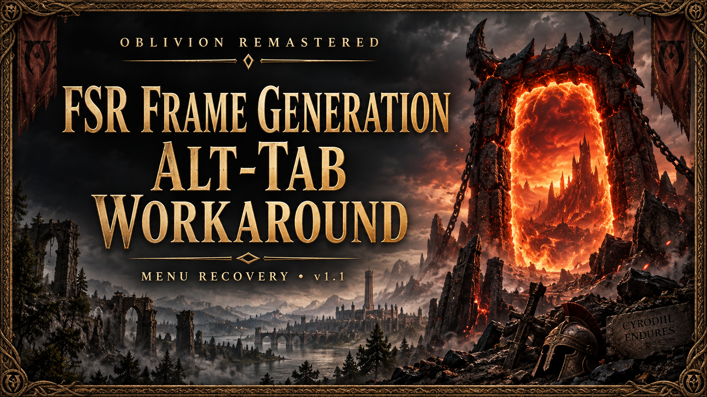

# FSR Alt-Tab Workaround installer 1.2

Source for DeadeyeDuncan1337's [Oblivion Remastered mod 5643](https://www.nexusmods.com/oblivionremastered/mods/5643).

These C# files are the sources included in the original v1.2 Nexus archive. This repository is provided for inspection and moderator review; it does not establish that the quarantined release has been cleared.

## Build

On 64-bit Windows with the .NET Framework 4.x C# compiler installed, open Command Prompt in this directory and run `build.cmd`. No NuGet packages or downloads are needed.

The exact production compilation command is:

```bat
"%WINDIR%\Microsoft.NET\Framework64\v4.0.30319\csc.exe" /nologo /target:winexe /r:System.Xml.Linq.dll /r:System.Windows.Forms.dll /r:System.Drawing.dll "/out:Apply FSR Fix.exe" App.cs Fix.cs
```

Do not define TEST for the production build. Compiler/build timestamps and environment differences can change binary hashes on rebuilding; this is not a claim of byte-for-byte reproducibility.

## Tests

Run `test.cmd`. Tests use temporary Engine.ini fixtures and leave their location in the output. The TEST symbol omits the running-game check only in the test executable. Production checks for running Oblivion processes before editing. Tests cover duplicate keys, other sections, repeat application, UTF-16 encoding, backups, removal, later unrelated edits, and refusal when target settings changed. Full UI and game-restart validation were pending at release.

## Behavior and review scope

- App.cs: Windows Forms interface; resolves Windows' Documents known folder, searches Windows/WinGDK configurations, and provides a file picker if necessary.
- Fix.cs: changes only `r.FidelityFX.FI.OverrideSwapChainDX12=0` and `vts.ToggleFSR3OnPauseMenu=1` within `[SystemSettings]` in the selected Engine.ini.
- Apply saves an original backup and XML recovery record alongside Engine.ini. Writes use a temporary file and File.Replace.
- Remove restores previously recorded key lines, retains unrelated edits, leaves backups, and refuses removal if the target values changed afterward.
- Applying over an existing manual tweak records that tweak as the prior state; removal returns to it.
- No network calls, shell execution, DLL injection, registry modification, startup persistence or elevation request. Process enumeration is used to detect a running game.
- Executable is unsigned and uncompressed; no packer or obfuscator is used.

## Quarantined release identification

Original ZIP SHA-256:
`728095cdf5c1d2a64ec947003bf6eb4b91335d20c91bd0ff4b61b9272a26c74f`

[VirusTotal archive report](https://www.virustotal.com/gui/file/728095cdf5c1d2a64ec947003bf6eb4b91335d20c91bd0ff4b61b9272a26c74f)

At inspection on September 13, 2026, the archive report showed 1/68 detections: MaxSecure `Trojan.Malware.300983.susgen`. The cause is not confirmed; moderator review is requested. No bypass of the quarantine is intended.
