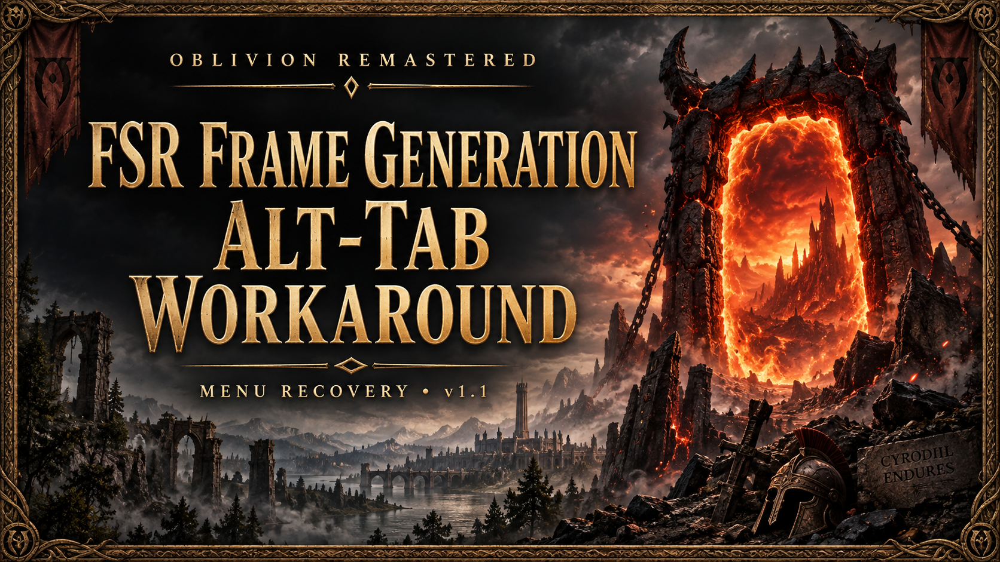

# FSR Alt-Tab Workaround installer 1.2

Source for DeadeyeDuncan1337's [Oblivion Remastered mod 5643](https://www.nexusmods.com/oblivionremastered/mods/5643).

These C# files are the historical **v1.2 installer source**. The current Nexus **v1.3 Manual Edition**, uploaded September 19, 2026, is text-only and contains no executable or script. This documentation update does not release a new installer.

## Current manual release

The [v1.3 description](https://www.nexusmods.com/oblivionremastered/mods/5643?tab=description) specifies:

```ini
[SystemSettings]
r.FidelityFX.FI.OverrideSwapChainDX12=0
vts.ToggleFSR3OnPauseMenu=0
```

Menu recovery is disabled to avoid menu-exit lag. Disabling the native AMD swap chain can reduce smoothness; this workaround is a tradeoff, not a general performance improvement. Only one Steam setup was tested in-game; WinGDK/Game Pass and third-party frame-generation combinations remain unverified. The [v1.3 manual file](https://www.nexusmods.com/oblivionremastered/mods/5643?tab=files&file_id=23734) is separate from this repository's installer source.

**Do not rerun this v1.2 installer to upgrade to the manual settings:** it writes `vts.ToggleFSR3OnPauseMenu=1`. If an existing installer-managed file is manually changed to `0`, its old Remove operation may refuse because the recorded installation values changed. Preserve the original backup and recovery record; do not delete them to force an operation. A manual-only installation has no installer recovery record, so prior values must be restored from the user's own backup.

Close the game before changing configuration and restart afterward. Confirm the configuration actually used by your edition; values in a file alone do not prove in-game effectiveness.

## Build

On 64-bit Windows with the .NET Framework 4.x C# compiler installed, open Command Prompt in this directory and run `build.cmd`. No NuGet packages or downloads are needed.

The exact production compilation command is:

```bat
"%WINDIR%\Microsoft.NET\Framework64\v4.0.30319\csc.exe" /nologo /target:winexe /r:System.Xml.Linq.dll /r:System.Windows.Forms.dll /r:System.Drawing.dll "/out:Apply FSR Fix.exe" App.cs Fix.cs
```

Do not define TEST for the production build. Compiler/build timestamps and environment differences can change binary hashes on rebuilding; this is not a claim of byte-for-byte reproducibility.

## Tests

Run `test.cmd`. Tests use temporary Engine.ini fixtures and leave their location in the output. The TEST symbol omits the running-game check only in the test executable. Production checks for running Oblivion processes before editing. Tests cover duplicate keys, other sections, repeat application, UTF-16 encoding, backups, removal, later unrelated edits, and refusal when target settings changed. Full UI and game-restart validation were pending at release.

## Behavior and review scope

- App.cs: Windows Forms interface; resolves Windows' Documents known folder, searches Windows/WinGDK configurations, and provides a file picker if necessary.
- Fix.cs: changes only `r.FidelityFX.FI.OverrideSwapChainDX12=0` and `vts.ToggleFSR3OnPauseMenu=1` within `[SystemSettings]` in the selected Engine.ini.
- Apply saves an original backup and XML recovery record alongside Engine.ini. Writes use a temporary file and File.Replace.
- Remove restores previously recorded key lines, retains unrelated edits, leaves backups, and refuses removal if the target values changed afterward.
- Applying over an existing manual tweak records that tweak as the prior state; removal returns to it.
- No network calls, shell execution, DLL injection, registry modification, startup persistence or elevation request. Process enumeration is used to detect a running game.
- Executable is unsigned and uncompressed; no packer or obfuscator is used.

## Reported limitations

Two [public comments](https://www.nexusmods.com/oblivionremastered/mods/5643?tab=posts) report failure or reduced smoothness without enough hardware/settings/version detail to reproduce them. These gameplay reports remain unresolved; installer tests do not establish frame-pacing behavior. Useful follow-up details are edition/store, installed mod version, GPU/driver, upscaler/frame-generation settings, other frame-generation mods, restart status, and gameplay versus menu-exit behavior. Share only the two relevant settings rather than whole configurations, personal paths, or account information.

## Historical v1.2 archive identification

The author archived the original Nexus file after finding an issue. The replacement was approved immediately; support subsequently examined that new version. The old archive's review history is not an unresolved quarantine affecting the current manual release.

Original ZIP SHA-256:
`728095cdf5c1d2a64ec947003bf6eb4b91335d20c91bd0ff4b61b9272a26c74f`

[VirusTotal archive report](https://www.virustotal.com/gui/file/728095cdf5c1d2a64ec947003bf6eb4b91335d20c91bd0ff4b61b9272a26c74f)

At inspection on September 13, 2026, this historical archive report showed 1/68 detections: MaxSecure `Trojan.Malware.300983.susgen`. This dated result identifies the old archive only; it is not a verdict on the replacement manual release.

## Credits

- **DeadeyeDuncan1337** — mod author, project direction, in-game testing, feedback, and publishing.
- **OpenAI Codex (AI assistant)** — assistance investigating the workaround, implementing the installer and tests, writing documentation, and creating the page artwork.

